# 使用Java开发的图书管理系统
## 部署说明：
基础环境：JDK8，Tomcat8，MySQL5.7
报错可以查看我的教程：[我的教程](https://github.com/rainweb521/My-tutorial)
## 有问题的可以加入这个群，大家一起交流
### 群一：226520254（满）
### 群二：793838509
## 如题，用Java开发而成，具备基础功能，读者可以注册登录，登录时会判断账号类型再分别跳到各自对应的页面，读者可以查找，借阅，还书，查看历史借阅记录，修改个人资料，密码等，管理员可以修改添加图书，修改添加读者，修改添加分类，管理借阅信息等等。

## 具体功能如下图

## 登录页面

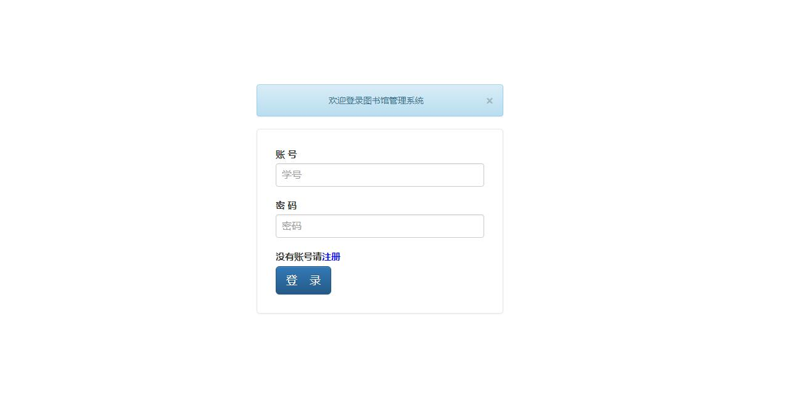

## 注册页面

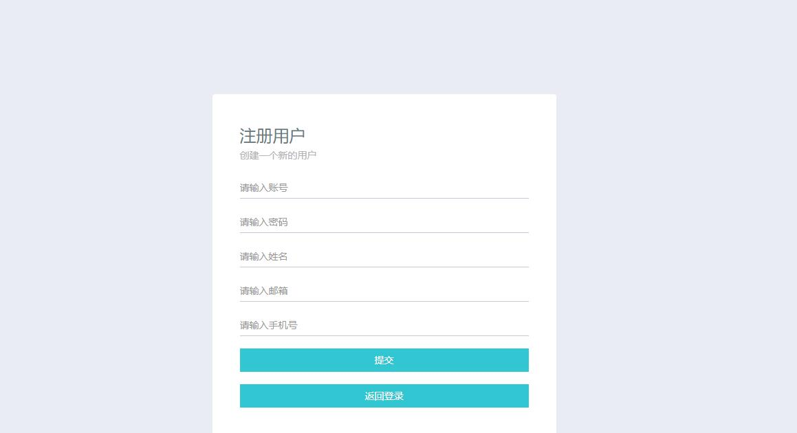

## 读者登录页面

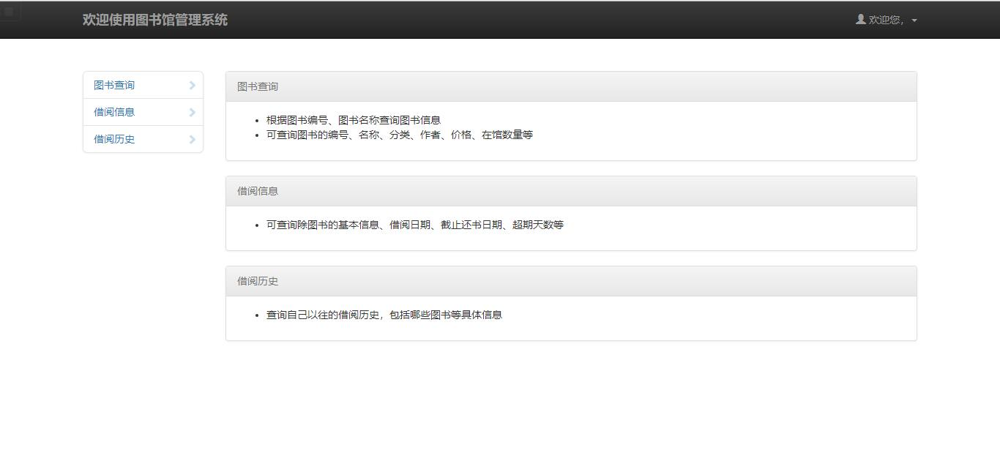

## 读者资料修改页面

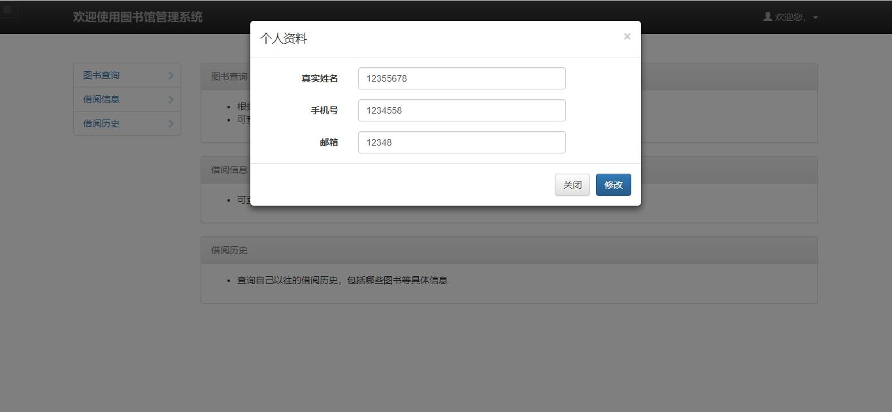

## 读者图书查询页面

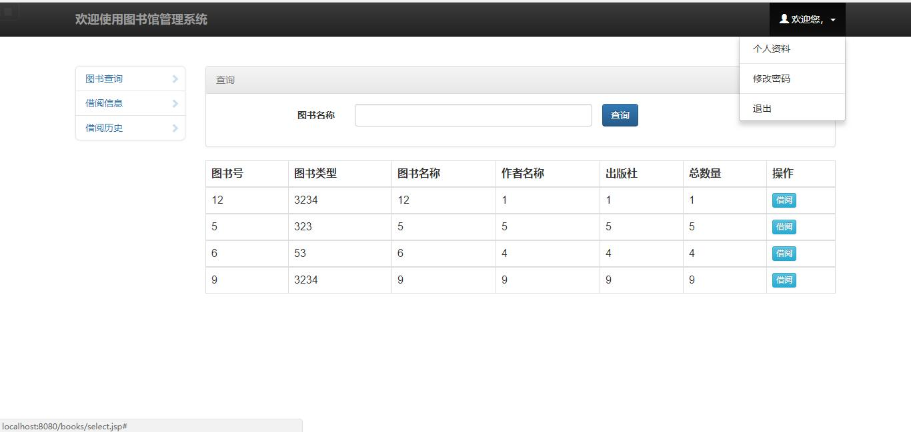

## 读者当前借阅信息页面

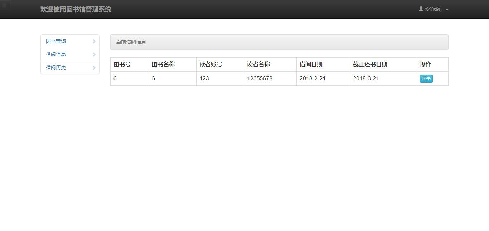

## 读者历史借阅信息显示页面

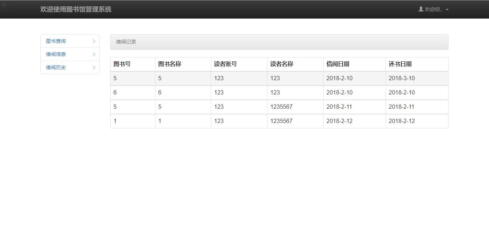

## 管理员登录页面

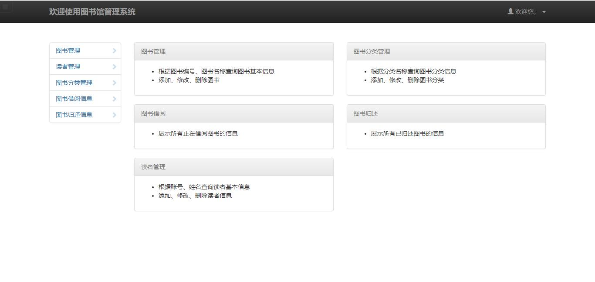

## 管理员管理图书信息页面

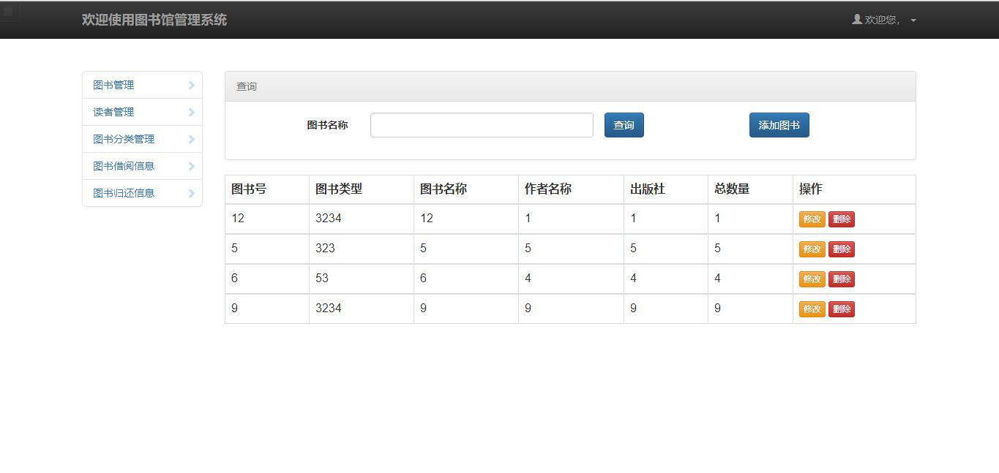

## 管理员添加图书页面

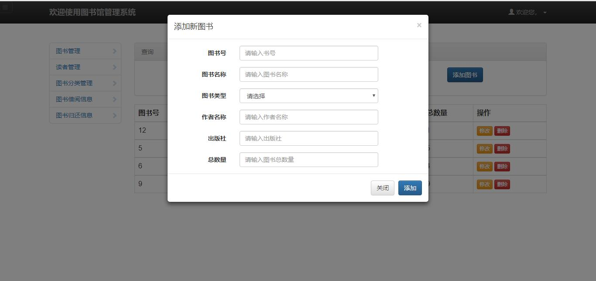

## 管理员管理用户界面

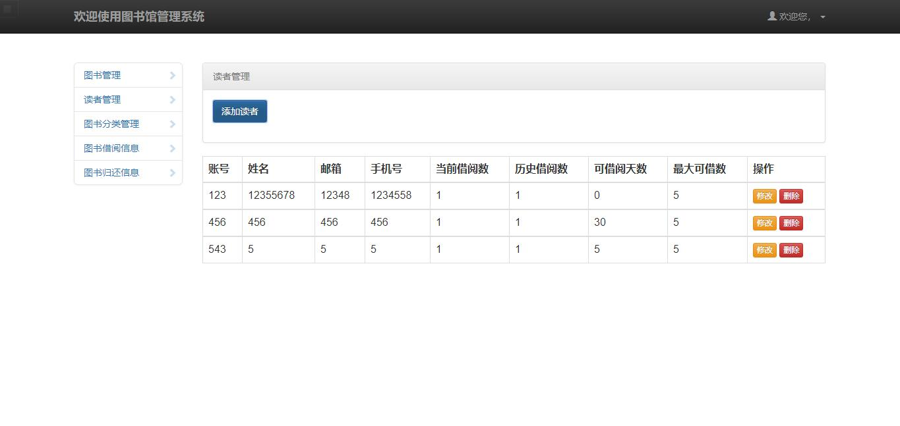

## 管理员添加读者信息的页面

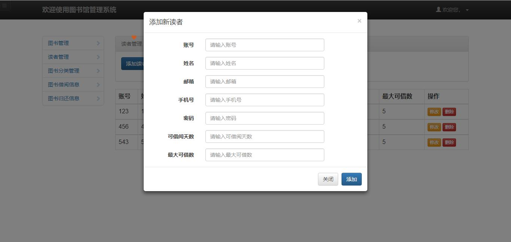

## 管理员管理图书分类的页面

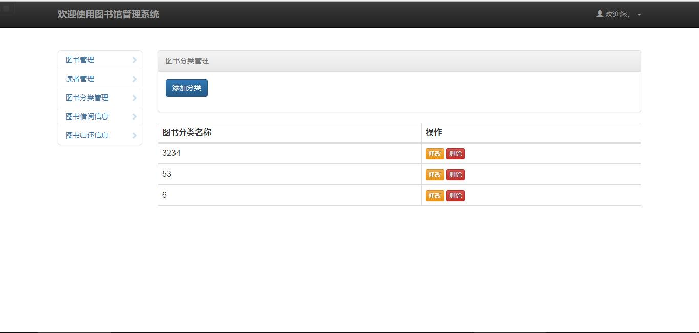

## 管理员管理图书借阅信息的页面

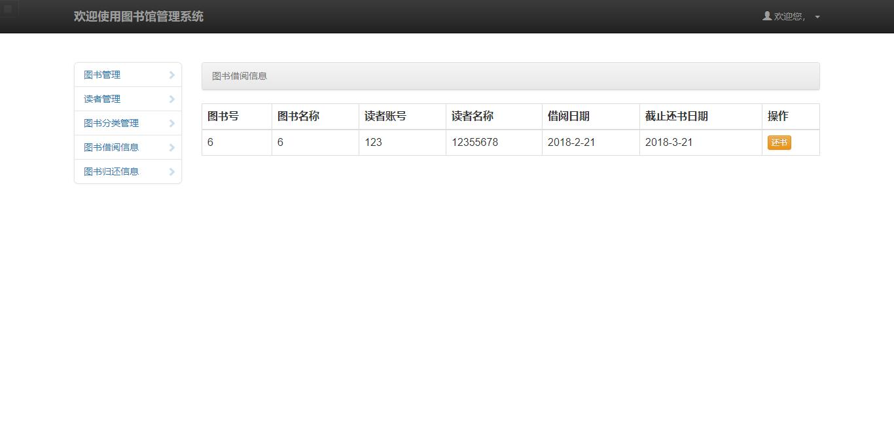

## 管理员管理已还书信息的页面

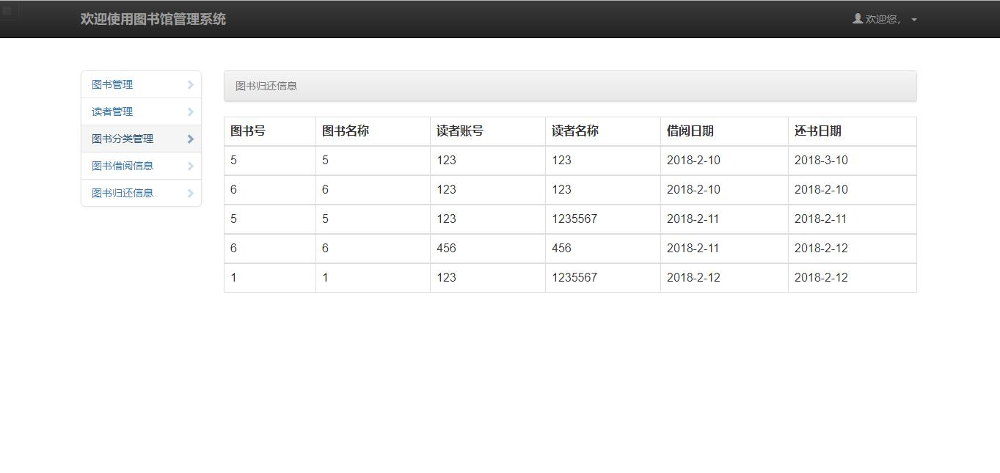
